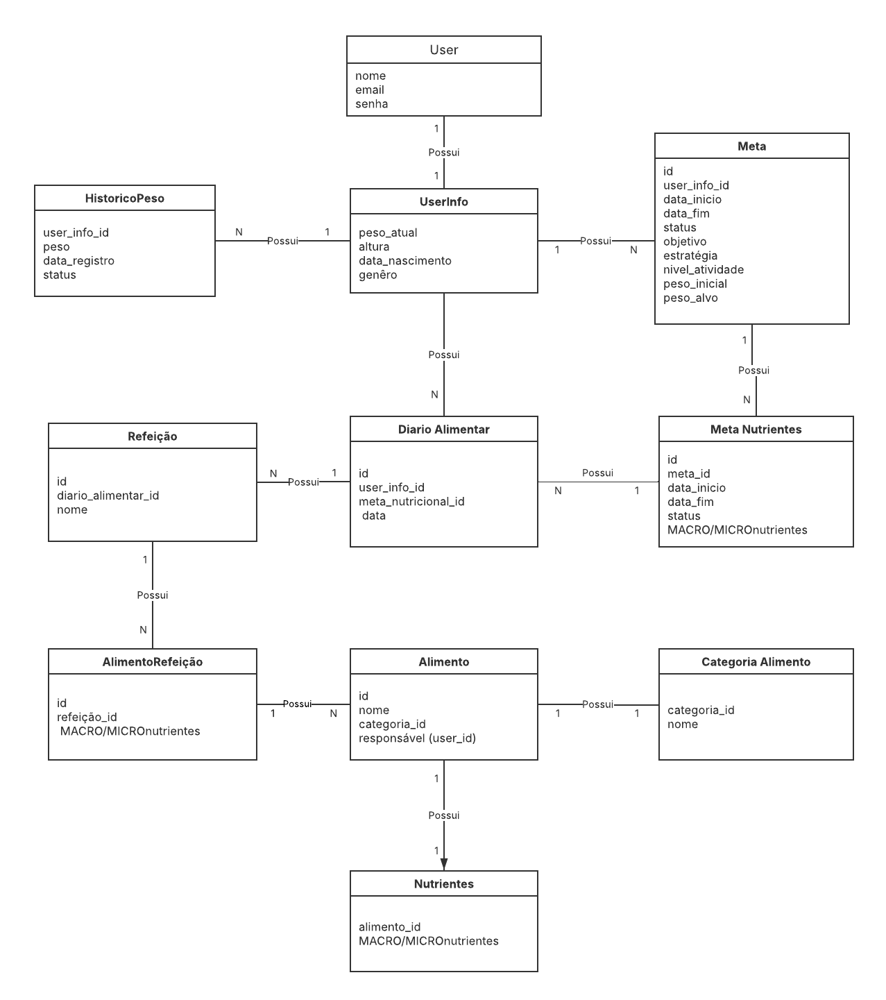

# 🏋️ Calorie Tracker API (Fitsy)

> **⏻ EM DESENVOLVIMENTO** | Backend em Spring Boot para rastreamento de calorias e gestão de refeições.

API RESTful desenvolvida com Spring Boot para rastreamento de calorias, gestão de refeições e acompanhamento nutricional. O sistema permite o registro detalhado de refeições e fornece recursos para auxiliar usuários na identificação de padrões alimentares e melhoria de hábitos.

---

## 🚀 Tecnologias Utilizadas

- **Java 21**
- **Spring Boot 4.0.1**
- **Spring Security** com autenticação JWT
- **Spring Data JPA** para persistência de dados
- **PostgreSQL** como banco de dados relacional
- **Flyway** para versionamento e migração de banco de dados
- **Lombok** para redução de código boilerplate
- **Bean Validation** para validação de dados
- **Maven** para gerenciamento de dependências

---

## 🏗️ Arquitetura

O projeto segue o padrão **MVC (Model-View-Controller)** com separação clara de responsabilidades:

```
src/main/java/dev/caio/fitsy/
├── config/          # Configurações (Security, CORS, etc)
├── controller/      # Camada de Controllers REST
├── dto/            # Data Transfer Objects (Request/Response)
├── exceptions/     # Tratamento de exceções
├── model/          # Entidades JPA
├── repository/     # Camada de acesso a dados
└── service/        # Lógica de negócio
```

### Princípios de Design:
- **RESTful API** com uso adequado de verbos HTTP e status codes
- **Separation of Concerns** com camadas bem definidas
- **DTOs** para controle de entrada e saída de dados
- **Mappers** para conversão entre entidades e DTOs

---

## 🔐 Segurança

- **Spring Security** configurado para proteção de endpoints
- **Autenticação JWT (JSON Web Tokens)** para sessões stateless
- **Criptografia de senhas** com BCrypt
- **Validação de entrada** em todas as requisições

---

## 📊 Modelo de Dados

### Principais Entidades:

- **User**: Usuário do sistema com autenticação
- **UserInfo**: Informações pessoais (peso, altura, idade, sexo)
- **Meta**: Metas de peso do usuário (perder, manter, ganhar)
- **MetaNutrientes**: Metas nutricionais calculadas (calorias, macros, micronutrientes)
- **DiarioAlimentar**: Registro diário de alimentação
- **Refeicao**: Refeições do dia (café da manhã, almoço, jantar, etc)
- **Alimento**: Cadastro de alimentos com informações nutricionais
- **Nutriente**: Informações nutricionais detalhadas por alimento
- **HistoricoPeso**: Acompanhamento da evolução do peso

### Relacionamentos:
- Relacionamento **One-to-One** entre User e UserInfo
- Relacionamento **One-to-Many** entre UserInfo e Meta
- Relacionamento **Many-to-Many** entre User e Role
- Relacionamento **One-to-Many** entre Meta e MetaNutrientes

---

## 🛠️ Funcionalidades Implementadas

### Autenticação
- ✅ Registro de novos usuários
- ✅ Login com JWT

### Gerenciamento de Usuário
- ✅ Criação de perfil com informações pessoais
- ✅ Atualização de peso
- ✅ Histórico de peso

### Metas
- ✅ Criação de metas personalizadas (perder, manter ou ganhar peso)
- ✅ Estratégias de meta (agressiva, moderada, conservadora)
- ✅ Atualização de meta ativa
- ✅ Histórico de metas
- ✅ Cálculo automático de metas nutricionais

### Nutrição
- ✅ Definição de metas nutricionais customizadas
- ✅ Acompanhamento de macronutrientes (proteínas, carboidratos, gorduras)
- ✅ Acompanhamento de micronutrientes (vitaminas, minerais)

### Diário Alimentar
- ✅ Registro de alimentos em refeições
- ✅ Cálculo automático de valores nutricionais

---

## 📡 Endpoints da API

### Autenticação (`/auth`)
```http
POST /auth/register    # Registrar novo usuário
POST /auth/login       # Login e obtenção de token JWT
```

### Informações do Usuário (`/user-info`)
```http
GET  /user-info                    # Obter informações do usuário
POST /user-info/create             # Criar perfil
PUT  /user-info/update-peso        # Atualizar peso
GET  /user-info/historico-peso     # Histórico de peso
```

### Metas (`/user-info/meta`)
```http
POST /user-info/meta/create        # Criar nova meta
PUT  /user-info/meta/active/update # Atualizar meta ativa
GET  /user-info/meta/active        # Obter meta ativa
GET  /user-info/meta               # Histórico de metas
```

### Metas Nutricionais (`/user-info/meta-nutrientes`)
```http
POST /user-info/meta-nutrientes/create  # Criar meta nutricional
GET  /user-info/meta-nutrientes/active  # Obter meta ativa
```

### Diário Alimentar (`/diario-alimentar`)
```http
POST /diario-alimentar/refeicao/alimento/add  # Adicionar alimento à refeição
```

---

## 🗃️ Banco de Dados

O projeto utiliza **PostgreSQL** hospedado no **[Neon](https://neon.tech/)**, uma plataforma serverless moderna para PostgreSQL que oferece escalabilidade automática e separação entre armazenamento e computação.

### 📐 Modelagem de Dados

O diagrama abaixo representa a estrutura completa do banco de dados e os relacionamentos entre as entidades:

<details>
<summary><strong>📊 Visualizar Diagrama ER (Entidade-Relacionamento)</strong></summary>


</details>

## 📝 Status do Projeto

🚧 **Em Desenvolvimento Ativo**

### Próximas Funcionalidades Planejadas:
- [ ] Geração de relatórios nutricionais
- [ ] Análise de padrões alimentares
- [ ] Sugestões personalizadas
- [ ] Exportação de dados

---

## 👨‍💻 Autor

Desenvolvido por [Caio](https://github.com/caioceo)

---

## 📄 Licença

Este projeto é um projeto pessoal desenvolvido para fins de estudo e portfólio.
